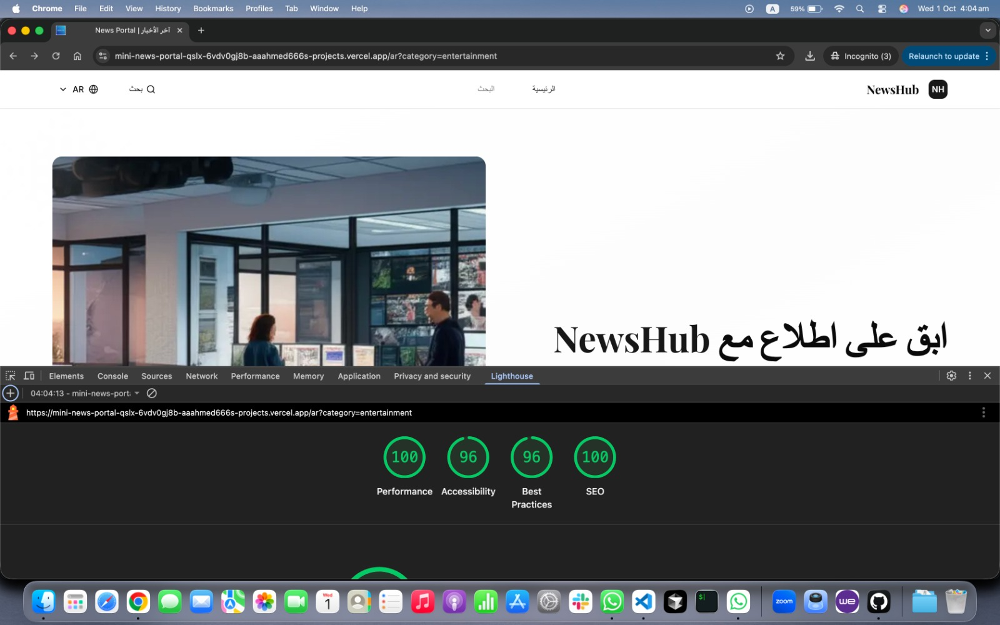

# 📰 NewsHub - Modern News Portal


A modern, multilingual news portal built with **Next.js 14**, featuring a clean design, internationalization (EN/AR), accessibility, and optimized performance.

---

## 📑 Table of Contents

- [Features](#features)
- [Tech Stack](#tech-stack)
- [Performance](#performance)
- [Getting Started](#getting-started)
- [📂 Project Structure](#-project-structure)
- [Available Scripts](#available-scripts)
- [Internationalization](#internationalization)
- [Customization](#customization)
- [Testing](#testing)
- [Deployment](#deployment)
- [Browser Support](#browser-support)
- [🗺️ Roadmap](#️-roadmap)
- [Contributing](#contributing)
- [License](#license)
- [Acknowledgments](#acknowledgments)
- [📸 Screenshots](#-screenshots)
- [📬 Contact](#-contact)

---

## 🚀 Features

| Feature              | Description                                    |
| -------------------- | ---------------------------------------------- |
| 🌍 Multilingual      | English & Arabic support                       |
| ↔️ RTL Support       | Proper right-to-left layout for Arabic         |
| 📱 Responsive Design | Mobile-first UI for all devices                |
| ⚡ Performance       | Optimized with Next.js 14 App Router           |
| 🔍 Search            | Full-text search with filters                  |
| 📰 Related Articles  | Smart recommendations                          |
| 🎨 Modern UI         | Tailwind CSS + shadcn/ui                       |
| ♿ Accessibility     | WCAG compliant with ARIA & keyboard navigation |
| 📊 SEO Friendly      | Meta tags, Open Graph & structured data        |

---

## 🛠️ Tech Stack

- **Framework**: [Next.js 14](https://nextjs.org/) (App Router)
- **Language**: [TypeScript](https://www.typescriptlang.org/)
- **Styling**: [Tailwind CSS v4](https://tailwindcss.com/)
- **UI Components**: [shadcn/ui](https://ui.shadcn.com/)
- **Icons**: [Lucide React](https://lucide.dev/)
- **Fonts**: [Geist](https://vercel.com/font) & [Playfair Display](https://fonts.google.com/specimen/Playfair+Display)
- **Testing**: [Vitest](https://vitest.dev/) & [Testing Library](https://testing-library.com/)
- **Linting**: [ESLint](https://eslint.org/) & [Prettier](https://prettier.io/)

---

## ⚡ Performance



---

## 🏁 Getting Started

### Prerequisites

- Node.js 18+
- pnpm (recommended) or npm

### Installation

````bash
git clone https://github.com/yourusername/newshub.git
cd newshub
pnpm install   # or npm install
pnpm dev       # or npm run dev


4. Open [http://localhost:3000](http://localhost:3000) in your browser.

## 📂 Project Structure

```bash
newshub/
├── app/                     # Next.js App Router
│   ├── [locale]/            # Internationalized routes
│   │   ├── article/         # Article pages
│   │   ├── search/          # Search pages
│   │   ├── layout.tsx       # Locale-specific layout
│   │   └── page.tsx         # Home page
│   ├── globals.css          # Global styles
│   ├── layout.tsx           # Root layout
│   ├── icon.tsx             # Favicon generator
│   └── apple-icon.tsx       # Apple touch icon
├── components/              # React components
│   ├── ui/                  # shadcn/ui components
│   ├── accessibility/       # Accessibility components
│   ├── article-card.tsx     # Article card component
│   ├── hero.tsx             # Hero section
│   ├── navigation.tsx       # Navigation bar
│   ├── pagination.tsx       # Pagination component
│   └── search-form.tsx      # Search form
├── lib/                     # Utility functions
│   ├── dictionaries/        # Translation files
│   │   ├── en.json          # English translations
│   │   └── ar.json          # Arabic translations
│   ├── data.tsx             # Mock data & API functions
│   ├── i18n.ts              # Internationalization config
│   ├── types.ts             # TypeScript types
│   └── utils.ts             # Utility functions
├── public/                  # Static assets
├── test/                    # Test files
└── middleware.ts            # Next.js middleware for i18n


## Available Scripts

- `pnpm dev` - Start development server
- `pnpm build` - Build for production
- `pnpm start` - Start production server
- `pnpm lint` - Run ESLint
- `pnpm lint:fix` - Fix ESLint errors
- `pnpm format` - Format code with Prettier
- `pnpm test` - Run tests
- `pnpm test:ui` - Run tests with UI
- `pnpm test:coverage` - Generate test coverage report
- `pnpm type-check` - Run TypeScript type checking

## Internationalization

The project supports multiple languages through Next.js internationalization:

- **English** (`/en`) - Default language
- **Arabic** (`/ar`) - RTL support with proper text direction

To add a new language:

1. Create a new dictionary file in `lib/dictionaries/`
2. Add the locale to `lib/i18n.ts`
3. Update the middleware in `middleware.ts`

## Customization

### Adding New Categories

Edit `lib/data.tsx` and add your category to the `categories` array:

\`\`\`typescript
{
id: "your-category",
name: "Your Category",
slug: "your-category",
color: "bg-purple-500",
description: "Category description"
}
\`\`\`

### Modifying Translations

Edit the JSON files in `lib/dictionaries/`:

- `en.json` for English
- `ar.json` for Arabic

### Styling

The project uses Tailwind CSS v4 with custom design tokens defined in `app/globals.css`. Modify the CSS variables to customize the theme:

\`\`\`css
@theme inline {
--color-primary: #1e40af;
--color-secondary: #3b82f6;
/_ Add your custom tokens _/
}
\`\`\`

## Testing

Run the test suite:

\`\`\`bash
pnpm test
\`\`\`

Run tests with coverage:

\`\`\`bash
pnpm test:coverage
\`\`\`

## Deployment

### Deploy to Vercel

The easiest way to deploy is using [Vercel](https://vercel.com):

[](https://vercel.com/new/clone?repository-url=https://github.com/yourusername/newshub)

### Manual Deployment

1. Build the project:
   \`\`\`bash
   pnpm build
   \`\`\`

2. Start the production server:
   \`\`\`bash
   pnpm start
   \`\`\`

## Browser Support

- Chrome (latest)
- Firefox (latest)
- Safari (latest)
- Edge (latest)

## Contributing

Contributions are welcome! Please follow these steps:

1. Fork the repository
2. Create a feature branch (`git checkout -b feature/amazing-feature`)
3. Commit your changes (`git commit -m 'Add amazing feature'`)
4. Push to the branch (`git push origin feature/amazing-feature`)
5. Open a Pull Request

## License

This project is licensed under the MIT License - see the [LICENSE](LICENSE) file for details.

## Acknowledgments

- [Next.js](https://nextjs.org/) - The React Framework
- [Vercel](https://vercel.com/) - Deployment platform
- [shadcn/ui](https://ui.shadcn.com/) - UI component library
- [Tailwind CSS](https://tailwindcss.com/) - CSS framework
- [Lucide](https://lucide.dev/) - Icon library

## Contact

For questions or support, please open an issue on GitHub or contact us at support@newshub.example.com

---

Made with ❤️ by the NewsHub Team
````
